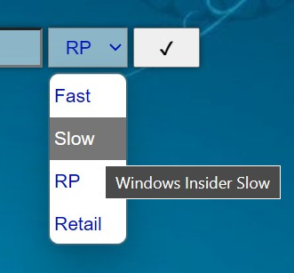
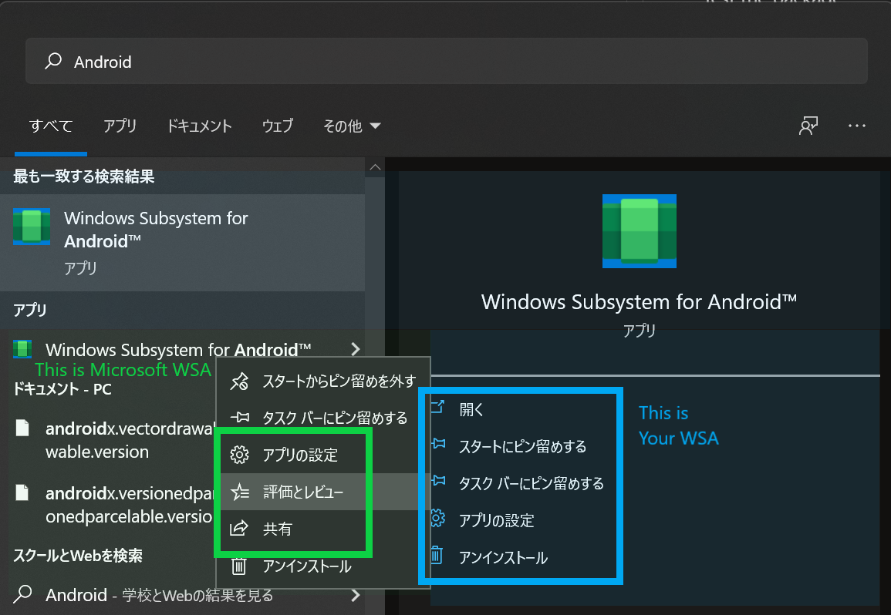

# Build WSA Kernel with Docker

This Dockerfile can help you to build the WSA Kernel.

Building the kernel on GitHub Actions takes about 30 minutes.

## How to build kernel?

1. Pull the docker image:
   ```bash
   docker pull ghcr.io/kiruyamomochi/wsa-kernel-build:main
   ```
2. Copy configuration if you have not configed in your kernel source:
   ```bash
   # For x86_64:
   cp configs/wsa/config-wsa-<kernel version number> .config
   # For arm64:
   cp configs/wsa/config-wsa-arm64-<kernel version number> .config
   ```
3. Build the kernel:
   ```bash
   # For x86_64:
   docker run --rm -v "<path to wsl kernel>:/src" -it ghcr.io/kiruyamomochi/wsa-kernel-build:main
   # For arm64:
   docker run --rm -v "<path to wsl kernel>:/src" -it ghcr.io/kiruyamomochi/wsa-kernel-build:main sh -c 'make -j$(nproc) LLVM=1 ARCH=arm64 CROSS_COMPILE=aarch64-linux-gnu Image'
   ```
   Remember to replace `<path to wsl kernel>` with the path to your WSA kernel.

> - If you use selinux you can add the z or Z options to modify the selinux label of the host file or directory being mounted into the container. See [Docker Documention](https://docs.docker.com/storage/bind-mounts/#configure-the-selinux-label) for details.
> - If you see error "... exceeds 64 characters", change `CONFIG_LOCALVERSION="-windows-subsystem-for-android"` in `.config` to something shorter.

## How it works?

It follows "WSA Linux Kernel build instructions" (WSA-README) in WSA Linux kernel source code.

## Where can I find WSA Linux kernel source?

You can get the url from <https://3rdpartysource.microsoft.com/downloads>.

If you are using PowerShell, you can use the following command to get the url:

```powershell
$json = Invoke-RestMethod 'https://3rdpartysource.microsoft.com/downloads'
$wsaKernel = $json | Where-Object Name -ILike '*WSA-Linux-Kernel.zip'
$wsaKernel.url
```

## How to use the built kernel?

### Download WSA package

First, download package of WSA.

1. Visit <https://store.rg-adguard.net/>, paste url below to the textbox.
   ```
   https://www.microsoft.com/p/windows-subsystem-for-android/9p3395vx91nr
   ```
2. Select **slow** ring in drop down menu. \
   We need to change this as long as WSA has not released in other channels. \
   
3. Click the tick and wait file list display.
4. Download the file maching pattern `*.msixbundle`.\
   It should normally appear at the bottom of the page, the size is larger than 1GB.

### Install the original package

Then, you need to install it, by typing this command in **PowerShell (Admin)**
```powershell
Add-AppPackage <path to your .msixbundle file>
```
It should complete without error.

### Decompress the package

An [msixbundle file](https://docs.microsoft.com/en-us/windows/msix/package/bundling-overview) is a zip archive of multiple MSIX packages.
We firstly decompress the msixbundle file by any decompressor you like (7-zip is recommend). You can also do it with PowerShell
```powershell
Expand-Archive <path to your .msixbundle file>
```

After the bundle file is decompressed, you can see lots of `*.msix` files.
Most of them, like files that ending with `_language-af.msix` or `_scale-100.msix`, are [Resource Packages](https://docs.microsoft.com/en-us/windows/msix/package/resource-package).
These package are not so important for the core of WSA, so we will ignore these for now, and decompress the main package.

There are two main packages, namely
```
WsaPackage_<version number>_x64_Release-Nightly.msix
```
and
```
WsaPackage_<version number>_ARM64_Release-Nightly.msix
```

Depends on your computer architecture, you need to decompress one of them. For most devices, decompress the package with `x64`. For ARM64 devices like Surface Pro X, you need to decompress the other one.

### Modify the package

In the decompressed package folder, remove `[Content_Types].xml`, `AppxBlockMap.xml`, `AppxSignature.p7x` and full `AppxMetadata` directory. 

If you have installed the official WSA before, you need to uninstall before continuing. 
Or you can use a different identity.

<details>
<Summary>(Optional) Use a different identity</summary>

Then modify `AppxManifest.xaml` by 
- Change `Package.Identity.Publisher` with something you like
- Remove the following nodes in `Package.Capabilities`
    - whose Name contains `customInstallActions`
    - whose CustomCapability contains `CustomCapability`
- In `Package.Extensions`, remove the full `Extension` node whose Category like `windows.customInstall`
Then save the file.

</details>

### Test the package

Now we test if the package can be installed and run correctly, if something not works properly, it's better to pause and find what goes wrong.

Do it in **PowerShell (Admin)**
```powershell
Add-AppxPackage -Register <path to your AppxManifest.xaml file>
```
> You need to turn on **developer mode**. If you are not sure, use `Show-WindowsDeveloperLicenseRegistration` in PowerShell to check it.

After adding, the new package will exist in start menu. It may confuse you that there are two WSA apps, but yours one should not contain ratings in the app context menu.



Open your WSA, and try run it by clicking or tapping the first "Files" option. If everything goes right, you can see a Files window after it loaded. But if you found it closes itself, something maybe wrong.

### Replace the kernel

If everything looks right, now you can replace the kernel!

Go to the folder that we modified files before, replace the file `kernel` under `Tools` with your kernel.
Then register the package again by do it in **PowerShell (Admin)**
```powershell
Add-AppxPackage -Register <path to your AppxManifest.xaml file>
```

Repeating the testing step, if you can run WSA, than congratulations! Your kernel is working. \
However, even if it does not wrong, we are sure that the problem with our custom kernels, not others. \
So we cam change kernel source, build and replace the kernel, then test it again.

## Troubleshooting

### "5.10.43-2-windows-subsystem-for-android-windows-subsystem-for-android" exceeds 64 characters

Change `CONFIG_LOCALVERSION="-windows-subsystem-for-android"` in `.config` to something shorter.

### Problems with WSA-README

- In step 2, there should be a `apt` after `sudo`:
   ```bash
   sudo apt install build-essential flex bison libssl-dev libelf-dev git gcc curl make bc bison ca-certificates gnupg libelf-dev lsb-release software-properties-common wget libncurses-dev binutils-aarch64-linux-gnu gcc-aarch64-linux-gnu
   ```
- In step 2, you also need to install `cpio`, or build will fail with `[kernel/kheaders_data.tar.xz] Error 127`:
   ```bash
   sudo apt install -y bc binutils-aarch64-linux-gnu bison build-essential ca-certificates cpio curl flex gcc gcc-aarch64-linux-gnu git gnupg libelf-dev libelf-dev libncurses-dev libssl-dev lsb-release make software-properties-common wget
   ```
- The real config file location is different from step 4
   - For x86_64: `configs/wsa/config-wsa-<kernel version number>` 
   - For ARM: `configs/wsa/config-wsa-arm64-<kernel version number>` 
- All spaces in WSA-README are incorrect, if you copy command from it, replace all spaces with ` `.

### "Help! I can't compile after patching the kernel [WSA-Kernel-SU](https://github.com/LSPosed/WSA-Kernel-SU)"

Are you copying those files? You should **append** (`>>`) them to corresponding file in kernel source, only copy file that does not exist in kernel.

❌ ~~`cp -r WSA-Kernel-SU/drivers/* WSA-Linux-Kernel/drivers/`~~

⭕
```bash
KERNEL_BASE=$KERNEL/drivers/base
SU_BASE=$SU/drivers/base

grep -q ASSISTED_SUPERUSER $KERNEL_BASE/Kconfig || cat $SU_BASE/Kconfig >> $KERNEL_BASE/Kconfig
grep -q ASSISTED_SUPERUSER $KERNEL_BASE/Makefile || cat $SU_BASE/Makefile >> $KERNEL_BASE/Makefile
cp $SU_BASE/superuser.c $KERNEL_BASE/superuser.c
```

### Why my WSA Settings doesn't display my language?

These files are in Resource Packages for your language.
We may need to find a way to merge them.
